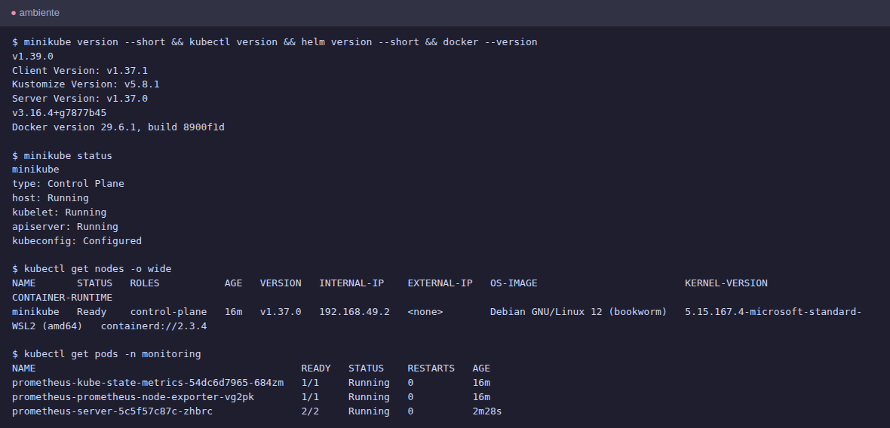
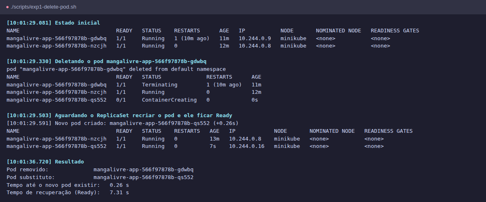
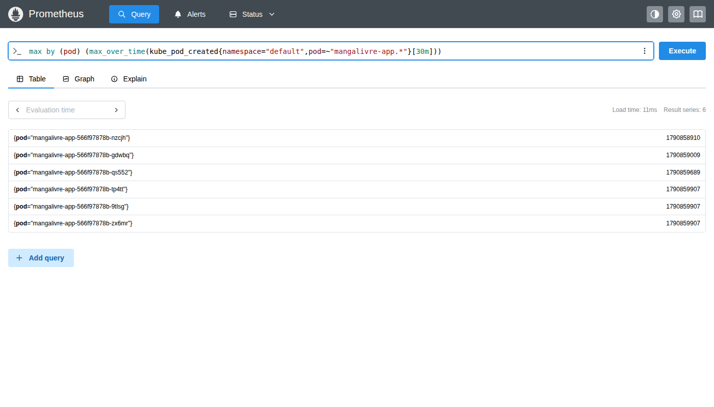
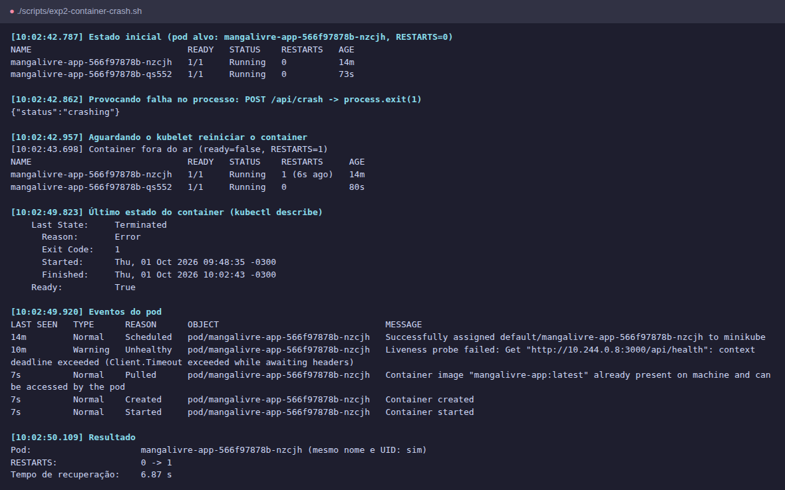
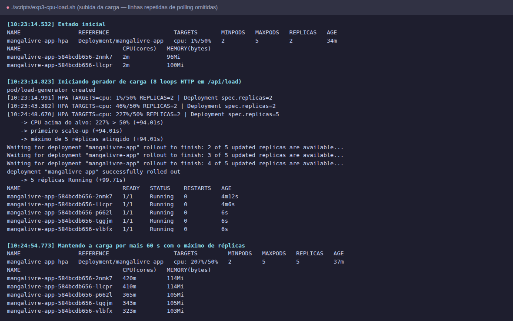
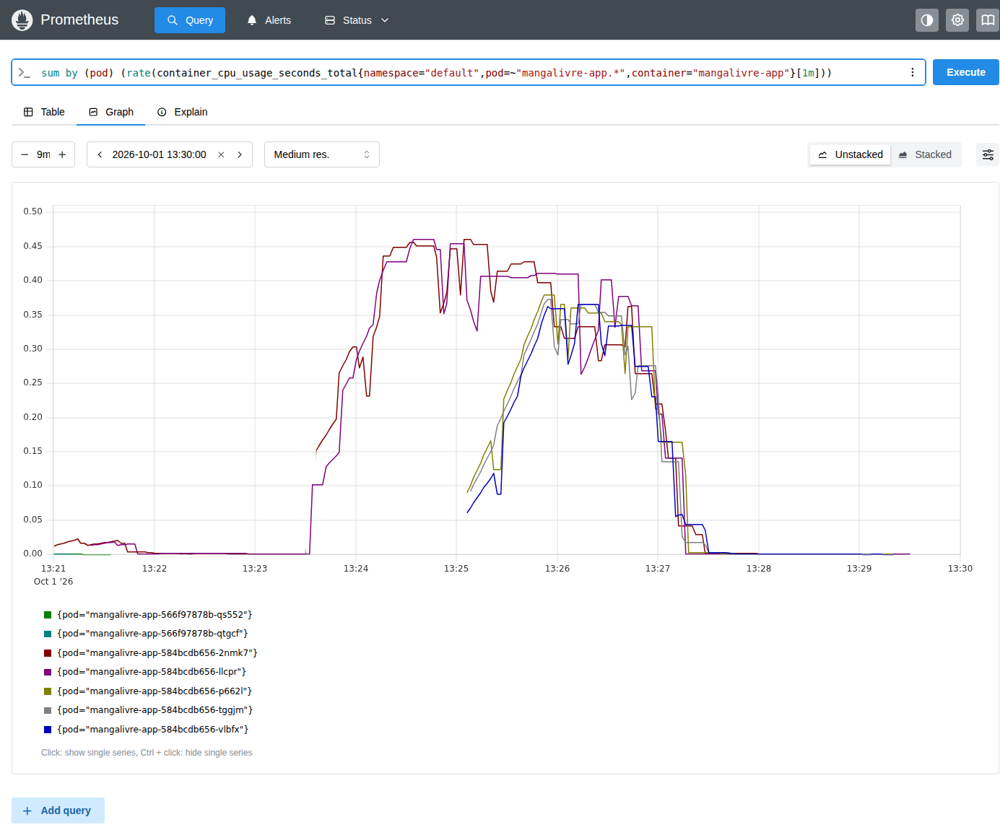
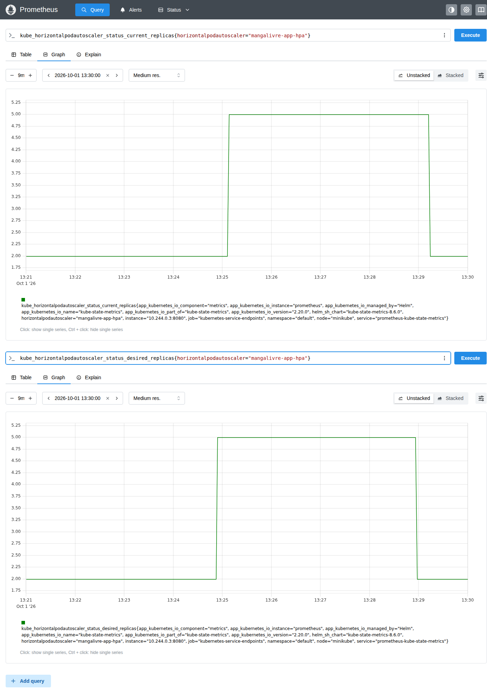
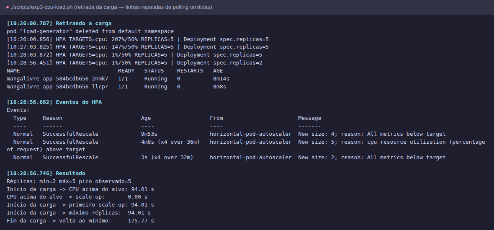
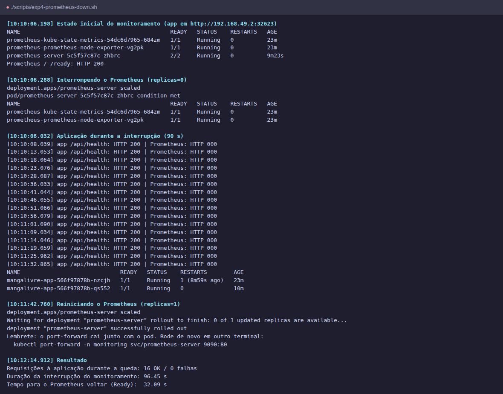
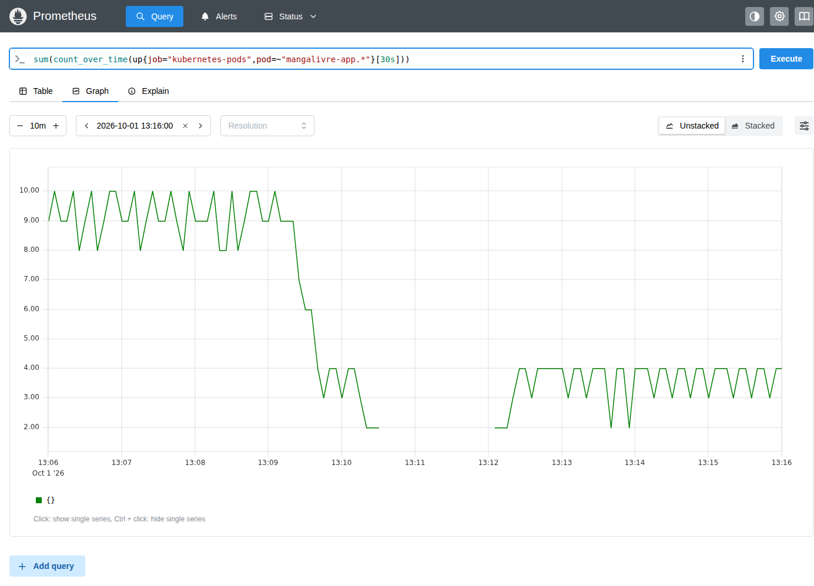

# Atividade 4 — Tolerância a Falhas e Monitoramento com Kubernetes + Prometheus

**Aluno:** Mauricio Benjamin · **Disciplina:** _<preencher>_ · **Data:** 01/10/2026

**Vídeo das demonstrações:** _<cole aqui o link do YouTube>_

**Repositório:** <https://github.com/mauriciobenjamin700/minikube-test>

---

## 1. Ambiente

Toda a atividade rodou em um único notebook, sem máquina virtual adicional: o Minikube usa o driver Docker, então o "nó" do cluster é um container.

| Item | Versão / valor |
| --- | --- |
| Sistema | Ubuntu 24.04 sobre WSL2 (kernel 5.15.167.4) |
| Container runtime do host | Docker 29.6.1 |
| Cluster | Minikube v1.39.0, driver `docker`, 4 vCPU e 6 GB, runtime `containerd` 2.3.4 |
| Kubernetes | v1.37.0 (servidor) / kubectl v1.37.1 |
| Métricas para o HPA | addon `metrics-server` do Minikube |
| Monitoramento | Prometheus (chart `prometheus-community/prometheus` via Helm 3.16.4), com kube-state-metrics e node-exporter |

Figura 1 — Versões das ferramentas, estado do Minikube, nó do cluster e pods do namespace monitoring (Prometheus, kube-state-metrics e node-exporter em Running).

## 2. Aplicação e configuração

A aplicação é o **Mangá Livre**, um sistema web em Next.js 15 com cadastro e login de usuários e banco PostgreSQL próprio. Para os experimentos ela expõe `GET /api/health` (alvo das probes, sem tocar o banco), `GET /api/metrics` (métricas Prometheus), `POST /api/crash` (encerra o processo com `exit 1`) e `GET /api/load` (consome CPU por até 1 s por requisição).

O Deployment da aplicação define:

- **2 réplicas** iniciais;
- **requests** de `200m` de CPU e `128Mi` de memória; **limits** de `500m` e `512Mi`;
- **livenessProbe** e **readinessProbe** HTTP em `/api/health` a cada 5 s, timeout de 5 s e 3 falhas seguidas para agir;
- annotations `prometheus.io/scrape`, para o Prometheus coletar `/api/metrics` de cada pod.

O **HPA** (`autoscaling/v2`) mantém entre **2 e 5 réplicas** com alvo de **50% de CPU** em relação ao request (ou seja, 100m por pod). O scale-up não tem janela de estabilização (`behavior.scaleUp.stabilizationWindowSeconds: 0`) e o scale-down tem 60 s, para o experimento caber no vídeo.

Figura 2 — Deployment, Service (NodePort) e HPA criados, e o trecho do `kubectl describe` com limits, requests, liveness e readiness probes.

**Prometheus.** Instalado com Helm no namespace `monitoring`, com coleta a cada 15 s e volume persistente (sem ele o histórico se perderia no Experimento 4). As métricas usadas vêm de três fontes: **kube-state-metrics** (fase dos pods, criação, reinicializações e réplicas do HPA), **cAdvisor** do kubelet (uso de CPU por container) e o `/api/metrics` da própria aplicação. As consultas PromQL estão no README do repositório. Os gráficos do Prometheus mostram o horário em **UTC**, e os terminais em UTC−3.

## 3. Experimentos

Cada experimento foi automatizado em um script (`scripts/exp1..4`) que imprime timestamps e calcula o tempo no final. As figuras de terminal são a saída real desses scripts; os logs completos estão em `docs/evidencias/`.

### 3.1 Experimento 1 — Deleção de pod

O script apaga o pod `mangalivre-app-566f97878b-gdwbq` e acompanha o ReplicaSet até o substituto ficar `Ready`.

Figura 3 — Pod removido entra em Terminating; o substituto qs552 aparece em ContainerCreating no mesmo instante e fica Running/Ready 7,31 s depois.

Figura 4 — Prometheus (kube-state-metrics): criação de cada pod da aplicação. O qs552 tem criação em 1790859689 (10:01:29), o instante exato da deleção do gdwbq.

**Tempo de recuperação:** novo pod criado em **0,26 s** e pronto em **7,31 s** (numa primeira execução, 6,22 s). Quase todo esse tempo é o Next.js subir mais o `initialDelaySeconds` (5 s) da readinessProbe; o controlador reage em menos de 1 s.

### 3.2 Experimento 2 — Falha no container

O script envia `POST /api/crash` para o pod `nzcjh`; o processo Node sai com código 1.

Figura 5 — Falha provocada: o container sai com Exit Code 1, o kubelet o reinicia no mesmo pod (mesmo nome e UID) e RESTARTS vai de 0 para 1. Recuperação em 6,87 s.

Figura 6 — Prometheus: `kube_pod_container_status_restarts_total` do pod nzcjh sobe de 0 para 1 no momento da falha.

**Tempo de recuperação:** **6,87 s** (numa primeira execução, 9,76 s).

**Recriar um pod × reiniciar um container.** No Experimento 1 quem age é o **controlador do ReplicaSet**, no plano de controle. O pod deixou de existir, então ele cria um **pod novo**: outro nome, outro UID, outro IP (10.244.0.9 → 10.244.0.16), escalonado do zero, e a contagem de RESTARTS começa em 0. No Experimento 2 o pod continua existindo e quem age é o **kubelet** do nó, conforme a `restartPolicy: Always`. Ele reinicia **só o container** dentro do mesmo pod: mesmo nome, UID, IP e volumes, e o contador RESTARTS sobe. Se o container falhar seguidas vezes, o kubelet espaça as tentativas (10 s, 20 s, 40 s… até 5 min), que é o estado `CrashLoopBackOff`. A livenessProbe leva ao mesmo caminho do Experimento 2: quando falha 3 vezes, o kubelet mata e reinicia o container.

### 3.3 Experimento 3 — Sobrecarga de CPU

Um pod `load-generator` (busybox) mantém 8 loops de `wget` em `/api/load?ms=300` através do Service, então a carga se espalha entre todas as réplicas, inclusive as novas.

Figura 7 — Subida: a CPU média vai de 1% a 227% do request; o HPA muda o Deployment para 5 réplicas (o máximo) 94,0 s após o início da carga, e as 5 estão Running em 99,7 s. Com 5 pods, cada um usa 323–420m, perto do limit de 500m.

Figura 8 — Prometheus (cAdvisor): uso de CPU por pod. Os dois pods iniciais sobem até ~0,45 core; as três réplicas novas aparecem às 13:25 UTC e dividem a carga; tudo cai a zero quando o gerador é removido.

Figura 9 — Prometheus (kube-state-metrics): réplicas atuais (em cima) e desejadas (embaixo) do HPA, em degrau 2 → 5 → 2. As desejadas mudam alguns segundos antes das atuais.

Figura 10 — Retirada da carga: com 60 s de estabilização mais a janela do metrics-server, o HPA volta ao mínimo de 2 réplicas 175,8 s depois, como registram os eventos SuccessfulRescale.

| Medida | Tempo |
| --- | --- |
| Início da carga → HPA enxerga CPU acima do alvo | 94,0 s |
| CPU acima do alvo → Deployment com 5 réplicas | no mesmo ciclo (< 2,3 s, resolução do script) |
| Início da carga → 5 réplicas Running | 99,7 s |
| Quantidade máxima de pods | 5 (o `maxReplicas`) |
| Fim da carga → volta a 2 réplicas | 175,8 s |

A maior parte do tempo de escalonamento é **atraso de métrica**, não decisão do HPA. O metrics-server só expõe uma média nova a cada ~60 s; o HPA consulta a cada 15 s; quando o valor chega (46% e depois 227%), a decisão de ir para 5 réplicas sai no mesmo ciclo. Como 227% está muito acima do alvo, o HPA pula direto de 2 para 5.

### 3.4 Experimento 4 — Interrupção do monitoramento

O script escala o `prometheus-server` para 0, faz uma requisição à aplicação a cada 5 s por 90 s e depois escala o Prometheus de volta para 1.

Figura 11 — Durante a queda o Prometheus não responde (HTTP 000), mas as 16 requisições à aplicação respondem HTTP 200. A interrupção durou 96,4 s e o Prometheus voltou a ficar Ready 32,1 s depois de reiniciado.

Figura 12 — Prometheus depois do retorno: amostras gravadas por janela de 30 s. Entre ~13:10:30 e ~13:12:10 UTC não há nenhuma amostra (a lacuna); o histórico anterior foi preservado pelo volume persistente.

**Por que a falha do monitoramento não é falha da aplicação.** O Prometheus está **fora do caminho da requisição**: ele só *puxa* (pull) métricas dos alvos de tempos em tempos. Aplicação, Service, kubelet, probes e HPA não dependem dele. O HPA lê o `metrics-server`, e as probes são executadas pelo kubelet. Por isso a aplicação continuou respondendo 100% das requisições. O efeito real é perder **visibilidade**: nada coletado durante a queda é recuperado depois, e qualquer alerta configurado ficaria cego nesse intervalo. Contadores cumulativos, como o de reinicializações, voltam com o valor correto na coleta seguinte; o que se perde é a série temporal da lacuna.

## 4. Resultados e análise

| Experimento | Quem reage | Resultado | Tempo |
| --- | --- | --- | --- |
| 1. Deleção de pod | Controlador do ReplicaSet | Pod novo (nome, UID e IP novos) | 7,31 s até Ready |
| 2. Falha no container | kubelet (`restartPolicy`) | Mesmo pod, RESTARTS 0 → 1 | 6,87 s até Ready |
| 3. Sobrecarga de CPU | HPA + metrics-server | 2 → 5 réplicas (máximo) → 2 | 94,0 s para escalar; 175,8 s para voltar |
| 4. Prometheus parado | — | App 16/16 OK; lacuna de ~100 s nas métricas | Prometheus Ready em 32,1 s |

- **Auto-recuperação** funcionou nos dois níveis: o Deployment manteve o número desejado de réplicas e o kubelet reiniciou o container que falhou. Em ambos os casos a aplicação seguiu atendendo pela outra réplica, o que mostra o valor de começar com 2 réplicas.
- **O HPA é limitado pela cadeia de métricas.** O ganho de tempo está em reduzir a resolução do metrics-server, não em mexer no HPA.
- **A configuração das probes importa sob carga.** Numa primeira rodada, com `timeoutSeconds: 2`, o event loop do Node ficou ocupado pelas requisições de `/api/load` e apareceram eventos `Liveness probe failed: ... Client.Timeout exceeded` em três pods (Figura 5 mostra um deles). Nenhum virou reinício (os únicos RESTARTS são os provocados no Experimento 2), mas uma probe agressiva demais pode matar pods sobrecarregados justamente quando o HPA mais precisa deles. Com 5 s, a rodada final não teve nenhuma falha de probe.
- **Monitoramento é observabilidade, não disponibilidade.** Sem volume persistente, parar o Prometheus apagaria todo o histórico, o que também foi observado numa execução de teste.

**Conclusão.** O cluster tolerou a remoção de pods, a falha de processo e o pico de carga sem indisponibilidade, e o Prometheus mostrou cada um desses eventos. A exceção foi a queda no número de pods ativos do Experimento 1: a substituição (≈7 s) é mais rápida que o intervalo de coleta (15 s), então o gráfico de pods em Running não chega a cair. A própria queda do Prometheus não afetou a aplicação.
